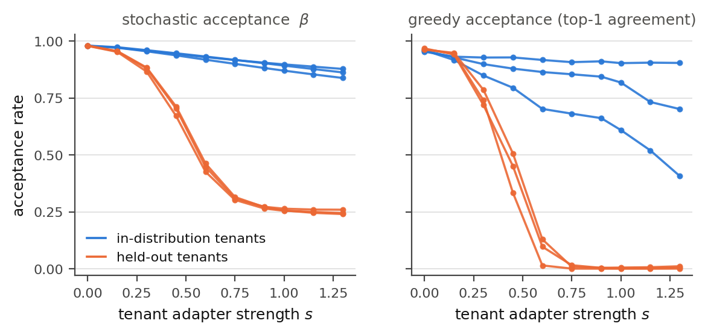
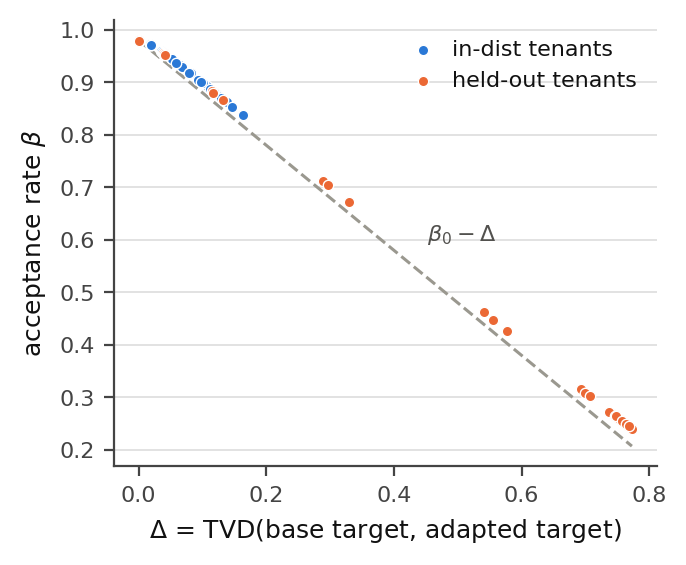
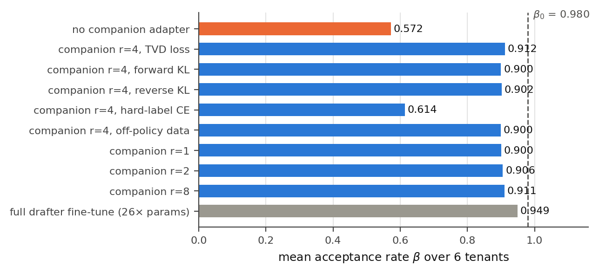

# TandemSpec

**Companion draft adapters for multi-tenant speculative decoding.**



**Figure 1.** Shared-drafter acceptance as each tenant's LoRA is scaled from 0 (base model) to 1.3.
Blue: tenants whose domain appears in the pretraining mixture. Orange: tenants fine-tuned on data the
base model never saw. Same drafter and same base model throughout — only the tenant's adapter changes.

## Results

| | acceptance β | tokens/step | greedy agreement |
|---|---|---|---|
| shared drafter, **unadapted** target | 0.980 | 4.81 | 0.957 |
| + in-distribution tenant LoRA | 0.887 | 3.99 | 0.777 |
| + held-out tenant LoRA | **0.259** | **1.35** | **0.003** |
| + rank-4 companion adapter (20 KB/tenant) | 0.912 | 4.23 | 0.650 |
| + private drafter fine-tune (26× params) | 0.949 | 4.52 | 0.817 |

<sub>Averaged over 6 tenants, γ=4, temperature 1.0. "greedy agreement" is top-1 match rate, the regime most production
serving actually runs in. Rows 2–3 are the same drafter and the same base model — only the tenant's adapter changes.</sub>



**Figure 2.** Acceptance against the distribution shift the adapter induces, pooled over all tenants and
strengths. Dashed line is the triangle-inequality bound `β₀ − Δ`; the measured slope is 0.82, so the
drafter absorbs part of the shift at low adapter strength and progressively less as it grows.



**Figure 3.** Mean acceptance by drafter-side training arm, over 6 tenants. A **20 KB** per-tenant adapter
recovers **83%** of the lost acceptance; a private per-tenant drafter recovers 92% and costs **2.5 GB**.
That ratio is the argument.

What the adapter is trained on matters more than how big it is:

| training signal for the companion adapter | acceptance β | % of loss recovered |
|---|---|---|
| none (shared drafter) | 0.5718 | — |
| hard-label cross-entropy on tenant tokens | 0.6136 | 10% |
| distil from adapted target, forward KL | 0.9000 | 80% |
| distil from adapted target, **TVD (= 1 − β)** | 0.9116 | 83% |

Matching *which tokens* the tenant's model emits is not enough — acceptance is a function of the full
distribution, so the drafter has to be distilled from it.

[Full writeup](paper/tandemspec_filled.md) · [first-order theory](paper/theory.md) ·
[vLLM RFC #52038 comment](rfc/vllm_rfc_52038_comment.md) ·
[interactive dashboard](results/tandemspec_dashboard.html) (download and open locally)

Figures are regenerated from the result JSON with `python experiments/make_figures.py`.

---


Two features that modern LLM servers ship independently do not compose:

* **Multi-LoRA serving** — one base model, hundreds of tenant adapters, selected
  per request and batched together (vLLM's punica/SGMV path).
* **Speculative decoding** — a small drafter proposes tokens that the target
  verifies (EAGLE-3.1, DFlash, draft models).

The drafter is trained to imitate the **base** model. Every request is verified
against **base + tenant adapter**. The drafter is therefore approximating the
wrong distribution for every adapted request, and because per-token acceptance
is exactly

```
beta = sum_v min(p_v, q_v) = 1 - TVD(p_target, q_draft)
```

the tenant's distribution shift is subtracted from acceptance almost
one-for-one. TandemSpec measures that loss and repairs it with a **rank-4 LoRA
on the drafter, minted per tenant**, trained by on-policy distillation from the
*adapted* target under a total-variation objective that *is* the acceptance rate.

## The three claims

1. **It gets worse as drafters get better.** `E[tokens/step] =
   (1-beta^(gamma+1))/(1-beta)`, so `dT/dbeta ≈ gamma(gamma+1)/2` — about 10x at
   `gamma=4`, ~36x at `gamma=8`. The penalty for ignoring the tenant's adapter
   grows *quadratically in speculation depth*, exactly the direction
   block-diffusion drafters are pushing.
2. **On-policy training data is free.** Speculative sampling is
   distribution-preserving, so the contexts the drafter is invoked on in
   deployment are distributed as the target's *own output*. Teacher rollouts
   from the adapted target are already on-policy — no RL, no interleaved
   sampling.
3. **The fix is cheap enough to mint per tenant.** For an 8B target with a 1B
   drafter: rank-32 task adapters are ~168 MB/tenant; rank-4 companion adapters
   are ~5.6 MB — 3.4% overhead on adapter memory and ~440x smaller than a
   private drafter per tenant.

## Repository layout

```
tandemspec/
  metrics.py            beta = 1 - TVD and the tokens/step closed form
  accept.py             exact speculative-sampling simulator (lossless, verified)
  config.py             pilot configuration
  models/
    lora.py             LoRA with a runtime strength knob + RTN int4 fake-quant
    tiny.py             small Llama-style transformer for the CPU pilot
    hf.py               HuggingFace glue so GPU runs use the same measurement code
  data/synth.py         sticky-HMM multi-domain source with computable ground truth
  train/routines.py     pretrain, drafter distillation, tenant LoRAs, companion adapters
  eval/
    acceptance.py       teacher-forced + rollout acceptance measurement
    throughput.py       step-cost model, optimal gamma, serving scenarios
  serving/
    paired_adapters.py  tenant -> (task LoRA, companion LoRA); admission + memory
    vllm_integration.py the concrete vLLM hook points and a support checker
experiments/
  stage0_pretrain.py    base target + shared drafter
  stage1_task_loras.py  six tenant adapters (3 in-distribution, 3 held-out)
  e1_acceptance_collapse.py
  e2_companion_repair.py
  e3_serving_model.py
  e4_quant_mismatch.py
  make_dashboard.py     self-contained HTML results dashboard
  gpu/tandemspec_gpu.py T4-sized pipeline on Qwen2.5-1.5B + Qwen2.5-0.5B
colab/                  notebook driving the GPU pipeline
paper/                  writeup + first-order theory
rfc/                    comment for vLLM RFC #52038
tests/                  simulator correctness (losslessness + closed form)
```

## Running the CPU pilot

No GPU required; the whole pilot is ~2M-parameter models on a synthetic source
with a computable Bayes-optimal predictor.

```bash
pip install torch numpy
python tests/test_accept.py                       # verify the simulator first
python experiments/stage0_pretrain.py             # base target + shared drafter
python experiments/stage1_task_loras.py           # six tenant adapters
python experiments/e1_acceptance_collapse.py      # the collapse curve
python experiments/e2_companion_repair.py         # companion adapters + baselines
python experiments/e4_quant_mismatch.py           # QLoRA train/serve mismatch
python experiments/e3_serving_model.py            # throughput + memory model
python experiments/make_dashboard.py              # results/tandemspec_dashboard.html
```

## Running on a 16 GB GPU (Colab T4)

`colab/TandemSpec_T4.ipynb` drives the same measurement code on real models.
T4 is sm_75: fp16 and SDPA, **not** bf16 or FlashAttention-2.

```bash
python experiments/gpu/tandemspec_gpu.py --stage tenants     # QLoRA tenant adapters
python experiments/gpu/tandemspec_gpu.py --stage e1          # collapse + strength sweep
python experiments/gpu/tandemspec_gpu.py --stage e2          # companion repair
python experiments/gpu/tandemspec_gpu.py --stage throughput  # measured cost ratio
```

## The serving change

One thing has to change in the engine: **a tenant id must resolve to a pair of
adapters**, both selected per request.

```python
from tandemspec.serving.paired_adapters import PairedAdapter, AdapterSpec, PairedAdapterRegistry

reg = PairedAdapterRegistry(max_loras=8, max_lora_rank=32, max_draft_lora_rank=8)
reg.register(PairedAdapter(
    tenant_id=7, name="acme",
    target=AdapterSpec("acme-task",      rank=32, path="/adapters/acme"),
    draft =AdapterSpec("acme-companion", rank=4,  path="/adapters/acme-draft"),
))
```

`max_loras` keeps its meaning — distinct tenants admitted per batch — and becomes
a constraint on pairs. The draft side allocates the same cardinality at a much
smaller rank, so the binding memory constraint stays the target side and
existing multi-LoRA scheduling is unchanged. Hook points for vLLM are enumerated
in `tandemspec/serving/vllm_integration.py`; `rfc/` contains the writeup aimed at
[vLLM RFC #52038](https://github.com/vllm-project/vllm/issues/52038), which
proposes drafter-side LoRA but selects it per *deployment* rather than per
*request*.

## Not covered by the PEFT-drafting negative result

[arXiv:2607.12422](https://arxiv.org/abs/2607.12422) shows PEFT-based
block-diffusion drafting fails in practice — longer accepted prefixes (2.881 vs
1.511) but 34 vs 188 tokens/s — because the adapter drafts on the **target's own
backbone**, making a draft forward as expensive as verification (~50.3 ms vs
~50.6 ms). TandemSpec's adapter rides on a *separate, small* drafter that the
serving stack already runs, so the draft forward stays 5-20x cheaper and the
adapter only changes which distribution it approximates. The authors scope their
claim to same-backbone adapters explicitly.
